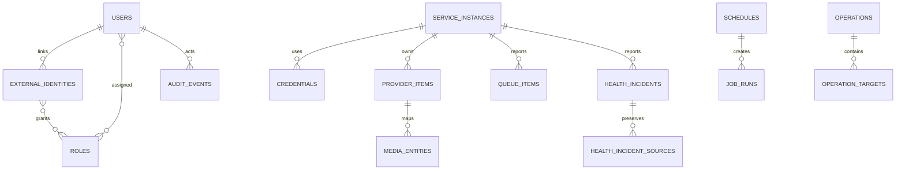

# Data Model

All identifiers are UUIDv7 when runtime support permits. Timestamps are `timestamptz` in UTC. User-facing names use case-insensitive uniqueness only where explicitly stated.

## Core tables

| Table | Key fields | Notes |
|---|---|---|
| users | id, email, password_hash, locale, timezone, state | normalized email unique; Argon2id hash |
| external_identities | issuer, subject, user_id, claims_version | validated case-sensitive `(issuer, subject)` unique |
| external_identity_roles | external_identity_id, role_id | reconciled OIDC-owned global grants; effective only for families authenticated by that external identity |
| roles / permissions / user_roles | id/name/scope | immutable system roles plus custom roles; manual assignments are global or instance-group scoped |
| identity_bootstrap_state | id, admin_user_id, completed_at | singleton sentinel permanently disables local bootstrap; admin reference becomes null on deletion |
| user_sessions | id, user_id, token_family_id, access_token_hash, access_expires_at, refresh_token_hash, expires_at, revoked_at, replaced_by_session_id, authentication_method | opaque tokens are stored only as 32-byte hashes; one active session per rotation family; method is `local` or `oidc` |
| oidc_session_contexts | token_family_id, external_identity_id, protected_id_token, expires_at | binds an OIDC family to its current external identity and protects the Authentik RP-logout hint; no access/refresh token |
| instance_groups | id, name | assignment scope and instance grouping; name unique |
| service_instances | id, kind, name, base_url, enabled, group_id | name unique; TLS/private-network policy is explicit; no inline secrets |
| credentials | id, instance_id, purpose, ciphertext, nonce, tag, key_version | one encrypted `api-key`, `username`, or `password` value per purpose; no plaintext column; 12-byte nonce, 16-byte tag, positive key version; write-only API |
| provider_capabilities | instance_id, capability, supported, observed_at | last complete probe snapshot; connection-setting changes invalidate it; drives UI/actions only when observed |
| provider_items | instance_id, provider_key, provider_kind, raw_kind, parent_provider_key, fingerprint | source-specific identity and selected non-secret provider data |
| media_entities | id, instance_id, provider_key, canonical_kind, title, year, monitored, has_file, external_ids_json | normalized one-to-one catalog projection |
| missing_items | instance_id, provider_key, reason, monitored, first_seen_at, updated_at | current movie/episode projection |
| missing_saved_views | id, user_id, normalized_name, filter_json | user-owned validated query filters; case-insensitive name unique per user |
| queue_items | instance_id, provider_key, download_id, correlation_key, status, remaining_bytes | current volatile projection |
| history_items | instance_id, provider_key, download_id, correlation_key, event_type, event_at | retained 30-day activity projection |
| health_incidents | id, instance_id, group_key, severity, first_seen_at, last_seen_at, resolved_at, acknowledged_at/by, snoozed_until/by | stable provider/source or remediation grouping; resolved incidents retained |
| health_incident_sources | incident_id, source_key, provider_issue_id, source, severity, message, remediation_url, first/last_seen_at, active | bounded raw diagnostics and safe HTTP(S) guidance; every related source is preserved |
| operations | id, type, actor_user_id, route, state, idempotency_key, request_hash, dry_run, cancellation_requested | aggregate bulk execution; actor+route+key unique |
| operation_targets | operation_id, instance_id, target_key, state, error_code, result_json | immutable target snapshot and per-target result |
| schedules | id, type, cron, timezone, scope_json, enabled | validated cron |
| job_runs | id, schedule_id, scheduled_for, available_at, lease_owner/token/until, state, attempts | retry-aware worker execution; the token fences stale lease holders |
| audit_events | occurred_at, id, actor, action, scope, outcome, summary_json | range-partitioned; database rejects updates |
| outbox_messages | id, type, payload, occurred_at, published_at, attempt_count, next_attempt_at | transactional redacted invalidations; unpublished rows have a partial claim index; published rows are the seven-day SSE replay log |
| sync_checkpoints | instance_id, stream, cursor, last_success_at, updated_at | atomically advances only with successful job completion |

## RBAC invariants

The permission catalog contains ten immutable codes: `instances.read`, `instances.manage`, `library.read`, `search.execute`, `queue.manage`, `tasks.execute`, `users.manage`, `audit.read`, `settings.manage`, and `authorization.manage`. The immutable system roles are Administrator with all ten permissions, Operator with `instances.read`, `library.read`, `search.execute`, `queue.manage`, and `tasks.execute`, and Viewer with `instances.read` and `library.read`. Custom roles use the same catalog and have case-insensitively unique names.

A `user_roles` row is a manual assignment. A null `instance_group_id` is global; a non-null value scopes every permission in that role to exactly one group. Multiple assignments are unioned, and a global grant dominates group grants for the same permission. Ungrouped service instances require a global grant. Deleting an instance group removes its scoped manual assignments and makes its service instances ungrouped through the existing foreign-key actions.

An `external_identity_roles` row is OIDC-owned and global, but it contributes to authorization only when the current session family's `oidc_session_contexts.external_identity_id` matches that assignment. Consequently, local session families and families from a different linked identity do not inherit it. Manual assignments apply to all of the user's valid session families.

Instance names and group names are unique. Instance connection state stores no inline secret. A connection-setting change (kind, base URL, TLS verification, or private-network policy) removes the old capability snapshot; the next probe replaces it atomically. The foundation probe persists only the generic `probe` observation and connectivity outcome. A configured `kind` is not evidence of provider compatibility; provider-specific capabilities are added only by contract-tested adapters. Deleting an instance cascades credentials and capabilities. An instance group must be empty before management deletion, preventing instances from becoming globally scoped by accident.

`PUT /authorization/users/{userId}/role-assignments` replaces all manual assignments for one user in a transaction; it does not read, delete, or rewrite `external_identity_roles`. Custom-role upsert/delete and assignment replacement serialize the last-global-manager check with the write, so concurrent mutations cannot remove every active user's global `authorization.manage` grant. Handled mutation outcomes append audit events with redacted summaries.

## Retention

Queue snapshots: current plus 30 days of transitions. Raw diagnostic payloads: disabled by default or 7 days. Audit: 365 days by default, configurable from 30 through 3,650 days. Metrics: delegated to the configured telemetry backend. Audit deletion runs as bounded durable work, is transactional, and appends its own system audit result after deleting expired rows.

## Migration policy

Forward-only EF Core migrations, tested from the oldest supported version. Startup applies pending migrations under a PostgreSQL advisory lock before HTTP or hosted services start, so multiple replicas serialize safely. `arrcontrol migrate` remains available for explicit operational runs. Destructive migrations require expand/migrate/contract phases.

The initial migration creates the identity, connections, operations, outbox, and automation foundation. `audit_events` is partitioned by `occurred_at` with a default partition so inserts remain safe before rolling time partitions are introduced; audit updates are rejected while retention may delete expired rows.

The local-authentication migration adds bootstrap state and short-lived access-token data. An installation that already has any user receives a disabled-bootstrap sentinel during upgrade. For a bootstrap-created administrator, configured bootstrap email/password values synchronize that same administrator at startup and revoke its sessions. Legacy session rows receive unique expired access hashes; non-32-byte refresh hashes are normalized and revoked, and duplicate active family rows are reduced before exact hash lengths and the single-active-family invariant are enforced.

The OIDC migration marks existing sessions as `local`, constrains new sessions to `local|oidc`, and adds external-role provenance plus protected token-family logout context. It does not rewrite existing identities or role assignments.

The RBAC migration seeds the ten permission rows and the three immutable system-role bundles independently of bootstrap. It upgrades an existing normalized Administrator role in place and grants it the complete catalog, while preserving custom roles and existing manual and OIDC assignments.

The durable-scheduler migration adds retry availability, heartbeat and opaque fencing-token columns to job runs, persists the last materialized occurrence on each schedule, and creates per-instance/stream checkpoints. Existing incomplete jobs are safely returned to `pending` with cleared leases; completed jobs normalize to `succeeded` or `failed`, existing scheduled occurrences seed `last_enqueued_at`, and `available_at` begins at the original scheduled time. New constraints enforce the state/lease/completion lifecycle.

The catalog-synchronization migration adds normalized `provider_items`/`media_entities` tables and a unique optional schedule scope key. Contract-supported Arr library schedule reconciliation uses `(type, scope_key)` to create exactly one 15-minute catalog schedule per enabled instance and disables it when the instance is disabled, deleted, or changes to an unsupported kind. Provider-item deletion cascades to its normalized media entity, while instance deletion cascades through the complete catalog projection.

The missing-query migration adds the current `missing_items` projection and user-owned `missing_saved_views`. It backfills monitored movies/episodes without files from an existing catalog, distinguishing already missing from not-yet-available items at migration time. Subsequent catalog snapshots update the projection transactionally. Saved-view deletion follows user deletion; saved-view filters may contain media-title search text, while their audit summaries contain only the view UUID.

The aggregated-activity migration adds current `queue_items` and retained `history_items`. A SHA-256 correlation key derived from the trimmed, case-normalized upstream download ID joins queue/history without depending on titles. The exact upstream ID remains bounded in PostgreSQL for diagnostics but is not returned by the read API. Instance deletion cascades both projections.

The operation-model migration adds operations and their target snapshots. Idempotency identity is `(actor_user_id, route, idempotency_key)` for 24 hours; the request hash distinguishes a safe replay from a conflicting key reuse. Targets retain individual terminal outcomes even when the aggregate is `partial`. Users cannot be deleted while their operations remain, and target instances cannot be deleted while referenced, preserving auditability.

The health-incidents migration adds stable per-instance incident groups and their source history. `(instance_id, group_key)` is unique, sources are keyed within an incident, and deletion of an instance cascades the projection. Acknowledging/snoozing users are nullable references so account deletion does not destroy operational history.

Health schedule reconciliation includes contract-supported request-manager instances, but their privacy-preserving request snapshots are currently adapter results rather than persisted tables. Recyclarr is a local CLI boundary and therefore creates neither a service-instance row nor provider credentials or schedules.
