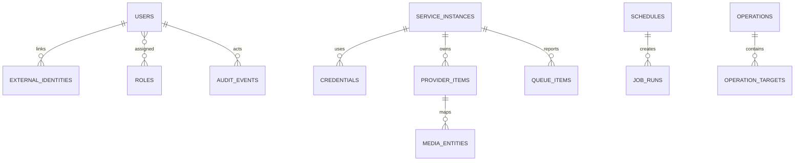

# Data Model

All identifiers are UUIDv7 when runtime support permits. Timestamps are `timestamptz` in UTC. User-facing names use case-insensitive uniqueness only where explicitly stated.

## Core tables

| Table | Key fields | Notes |
|---|---|---|
| users | id, email, password_hash, locale, timezone, state | normalized email unique; Argon2id hash |
| external_identities | issuer, subject, user_id, claims_version | `(issuer, subject)` unique |
| roles / permissions / user_roles | id/name/scope | immutable system roles plus custom roles |
| service_instances | id, kind, name, base_url, enabled, group_id | name unique; no inline secrets |
| credentials | id, ciphertext, key_version, updated_at | envelope-encrypted; write-only API |
| provider_capabilities | instance_id, capability, supported, observed_at | drives UI/actions |
| provider_items | instance_id, provider_key, media_entity_id, raw_kind, etag | source-specific identity |
| media_entities | id, canonical_kind, title, year, external_ids_json | normalized projection |
| missing_items | provider_item_id, reason, monitored, first_seen_at | current projection |
| queue_items | instance_id, provider_key, download_id, status, progress | volatile projection |
| health_issues | instance_id, source_key, severity, message_key, details_json | resolved_at retained |
| operations | id, type, actor_id, state, idempotency_key | aggregate bulk execution |
| operation_targets | operation_id, instance_id, provider_key, state, error_code | per-target result |
| schedules | id, type, cron, timezone, scope_json, enabled | validated cron |
| job_runs | id, schedule_id, lease_until, state, attempts | worker execution |
| audit_events | id, actor, action, scope, outcome, summary_json | append-only partitioned |
| outbox_messages | id, type, payload, occurred_at, published_at | transactional delivery |
| sync_checkpoints | instance_id, stream, cursor, last_success_at | incremental synchronization |

## Retention

Queue snapshots: current plus 30 days of transitions. Raw diagnostic payloads: disabled by default or 7 days. Audit: 365 days default and configurable. Metrics: delegated to the configured telemetry backend. Deletion jobs are audited and chunked.

## Migration policy

Forward-only EF Core migrations, tested from the oldest supported version. Startup does not automatically run migrations in multi-replica production; `arrcontrol migrate` or a one-shot Compose job does. Destructive migrations require expand/migrate/contract phases.
