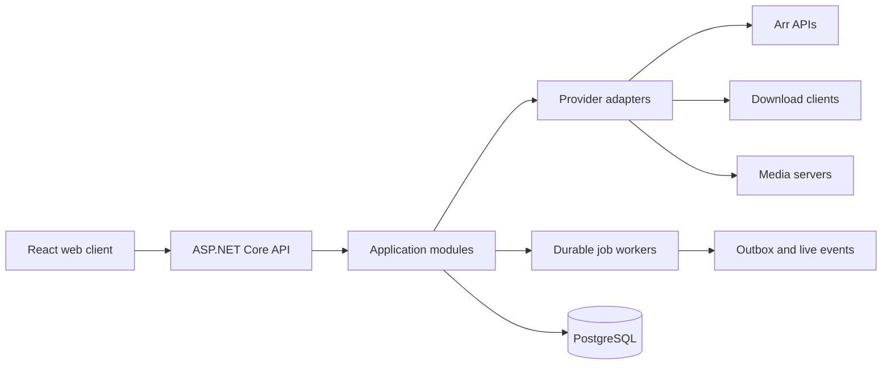

# Software Design Description

## Architecture

ArrControl uses a modular monolith first. This minimizes operational burden while preserving module boundaries and an out-of-process provider option later.

## Modules

- Identity: local accounts, OIDC identities, roles, sessions.
- Connections: instances, encrypted credentials, capability discovery.
- Catalog: normalized library and missing projections.
- Activity: queues, imports, histories, correlation.
- Search: interactive and bulk search orchestration.
- Automation: schedules, leases, executions, rate limits.
- Operations: health, notifications, audit, diagnostics.

Each module owns its tables and application commands. Cross-module reads use explicit query services; writes do not reach across DbSets. Integration events use a transactional outbox.

## Request and synchronization paths

Reads hit local projections and include `observedAt`, `sourceUpdatedAt`, and `stale`. Poll workers acquire per-instance leases, call adapters under timeout/rate-limit policies, normalize responses, and atomically advance checkpoints. Contract-supported Arr library endpoints have no dependable delta cursor, so their catalog worker computes a complete, bounded snapshot and applies a fingerprint-based local diff; an incomplete upstream pass is rejected before deletion. User commands create an operation record, authorize against instance scope, dispatch provider calls, and persist outcome/audit events.

## Provider boundary

Adapters implement narrow capability interfaces rather than one oversized interface. Raw payloads may be retained briefly for diagnosis but never become the domain model. Unknown enum values map to `unknown` and are recorded, preventing upstream additions from crashing synchronization.

Non-HTTP tools use a separate boundary instead of pretending to be service instances. The Recyclarr adapter invokes only allowlisted CLI commands through a shell-free process runner, while HTTP instance probing, SSRF policy, credentials, and capabilities remain exclusive to remotely addressable providers.

## Consistency and idempotency

- Database writes and outbox events share a transaction.
- Commands accept `Idempotency-Key`; keys are scoped to actor + route for 24 hours.
- Poll upserts use `(instance_id, provider_key)` natural uniqueness.
- Job claims use PostgreSQL advisory locks or `FOR UPDATE SKIP LOCKED` leases.
- Bulk actions snapshot target IDs and produce per-target results.

## Deployment topology

The initial image serves the SPA and API. PostgreSQL is separate. A later `worker` process uses the same image and role switch when scale requires it. Stateless containers permit horizontal API scaling; leaderless leased workers avoid duplicate jobs.

## Architecture decisions

- ADR-001 modular monolith before microservices.
- ADR-002 PostgreSQL authoritative store; no Redis required for v1.
- ADR-003 REST + live event channel, not GraphQL.
- ADR-004 MIT for broad free personal and commercial use with minimal obligations.
- ADR-005 secrets encrypted with a master key supplied outside the database.
- ADR-006 provider coverage is capability-based and contract-tested.

Full ADRs are maintained in `docs/adr/` as implementation decisions evolve.
